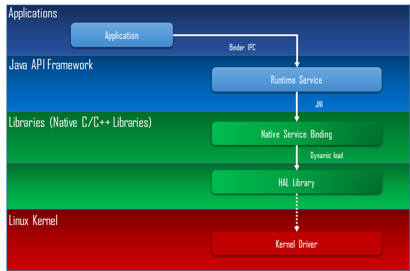
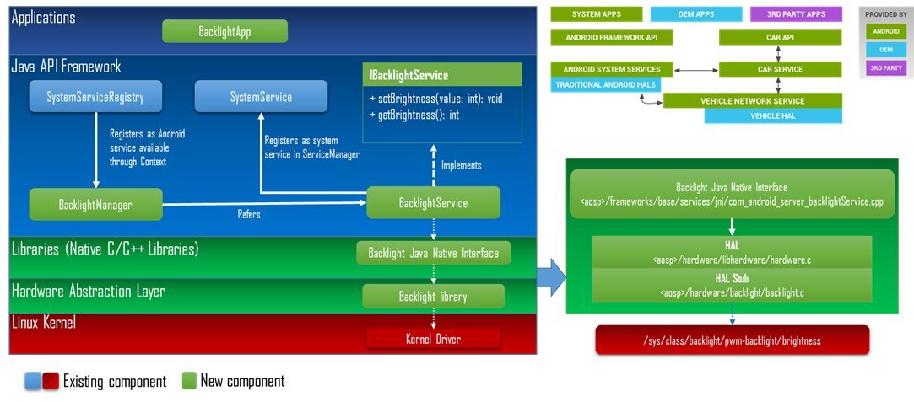
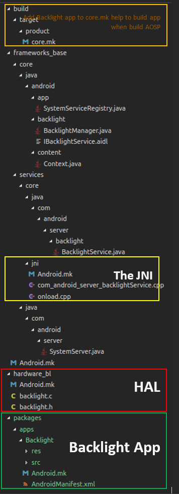

# Android HAL Backlight Demo on IMX6 (Android N)

## Part A: Prepare build environment

- Clone AOSP source
- Download BSP package for IMX6
- Clone IMX kernel
- Clone Uboot

### Clone AOSP source
```bash
cd ~
mkdir myandroid
cd myandroid
curl https://storage.googleapis.com/git-repo-downloads/repo > ~/bin/repo
# error: curl: (60) server certificate verification failed. CAfile: /etc/ssl/certs/ca-certificates.crt CRLfile: none
# Solution: curl -k https://storage.googleapis.com/git-repo-downloads/repo > ~/bin/repo
chmod a+x ~/bin/repo
~/bin/repo init -u https://android.googlesource.com/platform/manifest -b android-7.1.1_r13
# error: fatal: error [SSL: CERTIFICATE_VERIFY_FAILED] certificate verify failed (_ssl.c:590)
# Edit ~/bin/repo file
# import ssl
# ssl._create_default_https_context = ssl._create_unverified_context
~/bin/repo sync
```

### Download BSP package for IMX6

Open the [Link](https://www.nxp.com/support/developer-resources/hardware-development-tools/sabre-development-system/sabre-for-automotive-infotainment-based-on-the-i.mx-6-series:RDIMX6SABREAUTO?tab=Design_Tools_Tab )
Select correct BSP version. For example: `android_N7.1.1_1.0.0_source.tar.gz`

### Download IMX kernel

```bash
$ cd ~/myandroid
$ git clone http://git.freescale.com/git/cgit.cgi/imx/linux-imx.git kernel_imx
$ cd kernel_imx
$ git checkout n7.1.1_1.0.0-ga

```

### Download Uboot

```bash
$ cd ~/myandroid/bootable
$ mkdir bootloader
$ cd bootloader
$ git clone git://git.freescale.com/imx/uboot-imx.git uboot-imx
		
$ cd uboot-imx
$ git checkout n7.1.1_1.0.0-ga
```

Update 21.09.2018: Build u-boot only
```bash
$ cd ~/myandroid/bootable/bootloader/uboot-imx/
$ export ARCH=arm
$ export CROSS_COMPILE=~/myandroid/prebuilts/gcc/linux-x86/arm/arm-linux-androideabi-4.9/bin/arm-linux-androideabi-
$ make distclean
$ make mx6qsabreautoandroid_config
$ make
```

### Build

Apply patches:
```bash
$ cd ~/myandroid
$ source /opt/android_N7.1.1_1.0.0_source/code/N7.1.1_1.0.0/and_patch.sh
$ c_patch /opt/android_N7.1.1_1.0.0_source/code/N7.1.1_1.0.0/ imx_N7.1.1_1.0.0
```
Build,
```bash
$ source build/envsetup.sh
$ lunch sabreauto_6q-eng #or sabreauto_6q-user
$ make -j4 2>&1 | tee build-log.txt
```

Sometimes build failed due to out of memory, we need to restart jack-admin then make again.
```bash
$ export JACK_SERVER_VM_ARGUMENTS="-Dfile.encoding=UTF-8 -XX:+TieredCompilation -Xmx4096m"
$ out/host/linux-x86/bin/jack-admin kill-server
$ out/host/linux-x86/bin/jack-admin start-server
```

### Flash to SDCard
```bash
$ cd ~/myandroid/out/target/product/sabresd_6q
$ sudo chmod +x ./device/fsl/common/tools/fsl-sdcard-partition.sh
$ sudo ./device/fsl/common/tools/fsl-sdcard-partition.sh -f <soc_name> /dev/sdX
# For ex: imx6q sabre auto and sdcard /dev/sde
$ sudo ./device/fsl/common/tools/fsl-sdcard-partition.sh -f imx6q /dev/sde
# <soc_name> can be imx6q, imx6dl, imx6sl, imx6sx and imx7d.
```
Note:
- Unmount all the SD card partitions before running the script.
- Put the related bootloader, boot image, system image, recovery image in your
current directory. This script requires to install the `simg2img` tool on the computer.
`simg2img` is a tool that converts the sparse system image to raw system image on
the Linux OS host computer. The `android-tools-fsutils` package includes the
`simg2img` command for Ubuntu Linux OS.

Or use dd:
```bash
Download the U-Boot image:
# sudo dd if=u-boot.imx of=/dev/sde bs=1K seek=1; sync
Download the boot image:
# sudo dd if=boot.img of=/dev/sde1; sync
Download the Android system root image:
# sudo simg2img system.img system_raw.img
# sudo dd if=system_raw.img of=/dev/sde5; sync
Download the Android recovery image:
# sudo dd if=recovery.img of=/dev/sde2; sync
```

The outputs are generated by default in `myandroid/out/target/product/sabresd_6q`

## Part B: Develop BackLigth HAL

Let’s take a look to android architecture


- HAL provides standard interfaces that expose device hardware capabilities to the higher level.
- HAL Stub: 
   - Defined in `<aosp>/hardware/libhardware`
   - `libhardware/include/`: design interface, header files
   - hardware.c:  `load()`, `hw_get_module()`
   - `libhardware/include/hardware/hardware.h`
- Binder IPC allows app call into system service


### Backlight design overview



**BacklightApp**: Android application, which use `BacklightManager` to call our functions declared in `IBacklightService` (`.aidl file`), this AIDL allows you to define the programming interface that both the client and service agree upon in order to communicate with each other using interprocess communication (IPC).

On Android, one process cannot normally access the memory of another process. So to talk, they need to decompose their objects into primitives that the operating system can understand, and marshall the objects across that boundary for you. The code to do that marshalling is tedious to write, so Android handles it for you with AIDL.

`BacklightManager`: service proxy that will be visible from client app, this class should be registered in the 
`SystemServiceRegistry` static section.

`BacklightService`: implementation of `IBacklightService`, the implementation is to call `JNI` native methods.

`HAL`: hardware.c dlopen(backlight.imx6.so)

`HAL Stub`: define `HAL_MODULE_INFO_SYM`, read, write hardware node.

Structure of code:


#### The HAL
Please take a look at the source code under folder `hardware_bl`, which include `backligh.h` and `backlight.c` and an `Android.mk` file.

Base on this `Android.mk` the android build system will build HAL to a shared library (.so) and place it it `/system/lib/hw/`

#### The JNI
With the introduction of a JNI layer, we now move to the `frameworks/base` directory of Android sources, where a git project (named `frameworks_base`) implements the real meat of Android systems.

We'll start our new service from the bottom, that is the connection between the C/C++ HAL layer and the Java framework implementation.

Each service that communicates with an HAL needs a way to interface to native code, and the Java programming language provides a tool which allows native code to be executed from Java programs (and the other way around).
The path of the JNI service directory is then – `frameworks/base/services/core/jni/` where a series of cpp files, named with naming scheme resembling the service packages they are loaded by is present.

```bash
cd frameworks_base/services/core/jni
ls 
Android.mk  com_android_server_backlightService.cpp  onload.cpp

```
Append `com_android_server_backlightService.cpp` to `LOCAL_SRC_FILES` inside `Android.mk`.

Then register our JNI implementation in `onload.cpp`,
```cpp
// File: onload.cpp
namespace android {
...
int register_android_server_backlightService(JNIEnv *env);
...
extern "C" jint JNI_OnLoad(JavaVM* vm, void* /* reserved */)
{
...
    register_android_server_backlightService(env);
...
}
```

#### The service
Services are android libraries, usually written Java, which provide a remote endpoint for applications where to access system functionalities, privileged operations, and general abstraction to the underlying system.

Services run in privileged context compared to applications, and they perform sensible operations on their behalf.

While `frameworks/base` represents the most significant part of an Android system, and a lot of files are part of this repository, in general its organization can be divided in `frameworks/base/service/core` -> The “right” side of the Binder and `framework/base/core/` -> The “left” side of the Binder.

Implements the application-facing part of an Android system, which speaks with services using interfaces; the packages implemented here compose the Android API, and are usually part of the SDK.

The most important part of a system service is thus, its interface.

Android revolves around the well known IPC mechanism implemented by the Binder, which provides an RPC-like system and allow transactions to happen between objects that know each other only by their respective interfaces, with no explicit dependencies at build time, nor (even more important) at deploy time.

Binder has a long history and the web is full of articles about it and its internals, including comparisons with similar tools known by Linux developers due to their extensive presence in many distributions (d-bus and other RPC or general IPC daemons and utilities).

Interfaces are defined in Android by mean of a special language, called `AIDL` (Android Interface Definition Language), which closely resemble a traditional Java Interface definition.

Let’s start with `/frameworks_base/core/java/android/backlight/IBacklightService.aidl`
```java
// IBacklightInterface.aidl
package android.backlight;
// Declare any non-default types here with import statements

interface IBacklightService {
    int getBrightness();
    void setBrightness(int value);
}
```

We declare two interfaces `setBrightness()` and `getBrightness()`, this will expose to upper layer and would let application to use.
Interfaces get defined in the application facing part of the system, because they have to be visible to managers and application, we have prepared a directory for our interface in `/frameworks_base/core/java/android/backlight/` and modified `/frameworks/base/Android.mk` to add our `.aidl` file to `LOCAL_SRC_FILES += \`

Once we have defined an AIDL we have to implement the "real" service which will realize the above defined interface. Services are the “right” side of the Binder and reside in `frameworks/base/services/core/java/com/android/server`. Again we have prepared there a directory here to host our Backlight service.

In order to have out implementation of the above implemented AIDL interface, we need to Publish it to the Binder, and of course implement it, as an IBinder object;

In the service constructor we proceed in registering the service
```java
public BacklightService(Context context) {
        super(context);
        if (DEBUG){
            Slog.d(TAG, "Build service");
        }
        mContext = context;
        publishBinderService(context.BACKLIGHT_SERVICE, mService);
    }
```
The service will of course need to talk to the JNI we have prepared, so at the end of the file we declare the prototypes of the native functions we want to call.
At the time of service start, we also init the native layer:
```java
@Override
    public void onStart() {
        if (DEBUG){
            Slog.d(TAG, "Start BacklightService");
        }
        mNativePointer = init_native();
    }
```
Now it is time to implement the AIDL interface in the IBinder object we have published in the class constructor.

Since the interface is trivial, the implementation will also be very simple:
```java
private final IBinder mService = new IBacklightService.Stub() {
        /**
         * Implementation of the methods described in AIDL interface
         */
        @Override
        public int getBrightness() {
            if (DEBUG){
                Slog.d(TAG, "Call getBrightness service");
            }
            return getLight_native(mNativePointer);
        }
        
        @Override
        public void setBrightness(int value) {
            synchronized (this) {
                Slog.d(TAG, "value:" + value);
                int brightness = value & 0x000000ff;
                brightness = 0xff000000 | (brightness << 16) | (brightness << 8)
                        | brightness;
                if (DEBUG){
                    Slog.d(TAG, "setBrightness(" + brightness + ")");
                }
                try {
                    setLight_native(mNativePointer, brightness);
                } finally {
                    Trace.traceEnd(Trace.TRACE_TAG_POWER);
                }
            }
        }
```
In this way, when someone from the “left” side of the Binder will call `setBrightness()` or `getBrightness()`, it will simply trigger the JNI layer, which will then invoke the underlying HAL.

We need to tweak the Android system components to start it, the Android system server location, is at `frameworks/base/services/java/com/android/server/SystemServer.java`
```java
import com.android.server.backlight.BacklightService;
private void startOtherServices() {
…
    mSystemServiceManager.startService(BacklightService.class);
….
}
```
> **Note**: the SystemServer path is `frameworks/base/services/java/…/` and not `frameworks/base/services/core/…/`

#### The Manager
Associated with each service, there usually is a so-called Manager (services are sometimes called *ManagerService). Managers provide an application a suitable API, that becomes part of the SDK, and mediates between apps and remote services.

Our manager will use the remote services interface, and will not do anything particularly useful. In “real” use cases, managers take care of delivering notifications, filtering intents, and check permissions. In some cases managers tie directly into jni when HW access is performed directly from Java (eg. USB device)

Manager will be placed in – `frameworks/base/core/java/android/backlight` in the `android.backlight` package, where we put the AIDL interface of our service;

Once we have implemented both managers and service, we need a way to retrieve them from application, and start calling their methods.  The default way to retrieve a manager instance is to use the `getSystemService` method, providing the right identifier.

We need to register our new service and our manager in order to be able to retrieve them later, and we have to do that in `frameworks/base/core/java/android/app/SystemServiceRegistry.java`
```java
import android.backlight.BacklightManager
import android.backlight.IBacklightService

static {
...
    registerService(Context.BACKLIGHT_SERVICE, BacklightManager.class,
        new CachedServiceFetcher<BacklightManager>() {
        @Override
        public BacklightManager createService(ContextImpl ctx) {
            IBinder b = ServiceManager.getService(Context.BACKLIGHT_SERVICE);
            return new BacklightManager(ctx, IBacklightService.Stub.asInterface(b));
        }
    }
}
...
```
And remember to add service name constant to the `Context` class so clients can use it instead of hardcoded string: 
```java
 //File: Context.java
 public static final String BACKLIGHT_SERVICE = "backlight_service";
```

For Android N we need to add an entry to `/system/sepolicy/`
Add new entry to `{aosp}/system/sepolicy/service.te`:
```shell
type backlight_service, app_api_service, system_server_service, service_manager_type;
```
And new entry to `{aosp}/system/sepolicy/service_contexts`
```bash
backlight                              	u:object_r:backlight_service:s0
```

#### The Backlight Application
Located at packages/app/Backlight.

Append our application into `PRODUCT_PACKAGEs` in `build/target/product/core.mk`

### Deploy and testing
Now that all pieces are in place, we just need to update the system API, to have our new objects available to applications.
```bash
$ make update-api
$ mmma frameworks/base
# but it takes a long time, otherwise build frameworks-res alone, then rebuild frameworks
$ mmm frameworks/base/core/res $ mmm frameworks/base
```
Let’s now deploy all our pieces onto the real target
```bash
$ adb remount
$ mmm hardware/backlight/; adb push out/target/product/sabreauto_6q/system/lib/hw/backlight.imx6.so system/lib/hw/
$ mmm frameworks/base/; adb push out/target/product/sabreauto_6q/system/framework/framework.jar system/framework/
$ mmm frameworks/base/services; adb push out/target/product/sabreauto_6q/system/framework/services.jar system/framework/; adb push out/target/product/sabreauto_6q/system/lib/libandroid_servers.so system/lib/
$ adb reboot
```

Install Backlight app:
```bash
mmm -B packages/apps/Backlight; adb push out/target/product/sabreauto_6q/system/app/Backlight /system/app/
```
Then force close and restart the app.

That's all.
